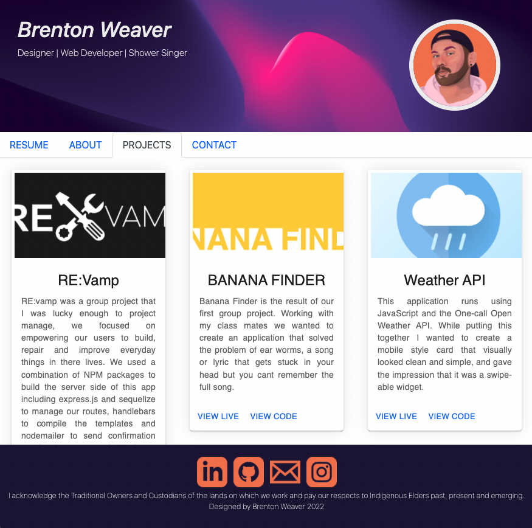

# 20 React JS: Updated Portfolio
**Deployed link: https://steamedpotatos.herokuapp.com/**

**GitHub Repo Link: https://github.com/Brento20/react-profile**

## User Story

```md
AS AN optimistic developer hoping for a fulfilling career in web development,
I WANT to show an interactive portfolio built using React.js 
SO THAT employers can see that I can do the things!
```

## Installation
1. Download repo
2. CD to repo location
3. Run $ NPM install
4. CD to react-profile-brenton
5. Run $ NPM start

## Acceptance Criteria


|element| status |
|--|--|
|Is a single-page application | Done |
|Page has a Header, content area and footer |Done|
|Name is displayed and there is navigation |Done|
|Has titles like About me, portfolio, resume and contact |Done|
|Navigation docent refresh the page, but does display content |Done|
|About Me title and section are selected by default | Done |
|recent photo or avatar of the developer and a short bio about them|Done|
|images of six of the developer’s applications with links to both the deployed applications and the corresponding GitHub repositories| Chose to do 3, I could do 6 but I wanted to keep the quality high on the past work |
|contact form with fields for a name, an email address, and a message| Done|
| Footer contains appropriate links and text |Done|
|Hosted on Heroku |Done|


## Logic Plan

1. Build the basic containers/components.
2. Use navbar from instructor example to build navigation.
3. Find an effective way to display projects.
4. Research NPM packages that can build the project faster/easier/better.
5. Host on github and heroku.


## Image of application


